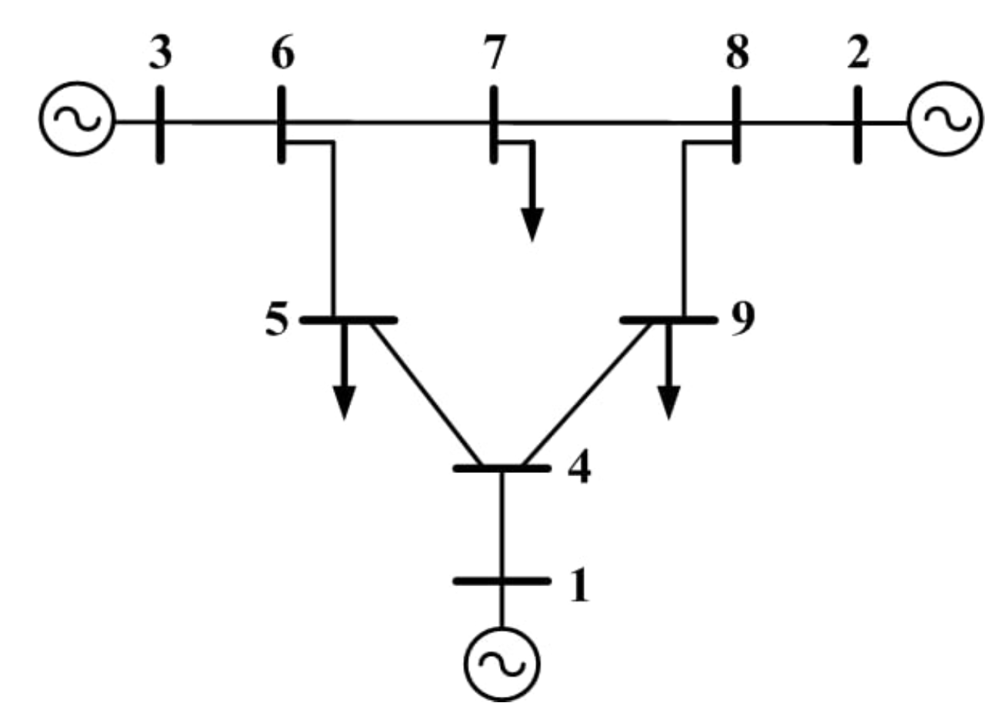

# Power Flow Solution
In this project we were asked to obtain the power flow solution of a 9-bus power system network by the following methods:
- Gauss-Seidel power flow
- Newton-Raphson power flow
- Fast decoupled power flow

A full description in Persian is also included.

## Network Diagram

